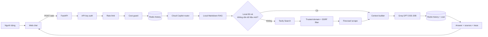
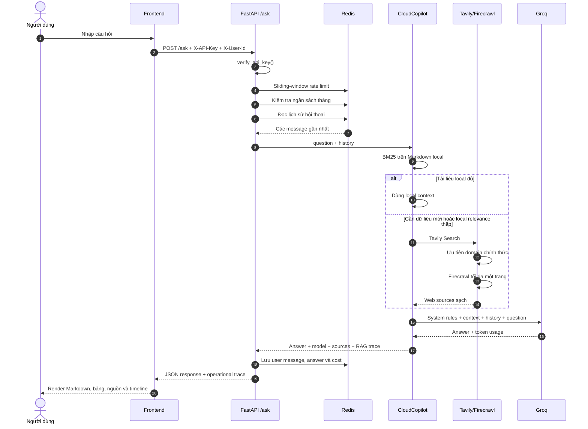

# Tài Liệu Buổi Day 12 Và Luồng Cloud Deployment Copilot

> Học viên: **Nguyễn Chí Hiếu** — `2A202601931`
> Ngày thực hiện: **10/08/2026**
> Production: https://day12-agent-plt0.onrender.com

## 1. Mục tiêu của buổi học

Buổi Day 12 tập trung vào việc đưa một AI service từ môi trường local lên cloud theo
cách có thể vận hành thật. Mục tiêu không chỉ là “deploy chạy được”, mà còn phải giải
quyết các vấn đề xảy ra khi service được mở ra Internet:

- Cấu hình bằng biến môi trường theo 12-Factor.
- Không để API key và connection string trong source code.
- Đóng gói ứng dụng bằng Docker multi-stage và chạy bằng non-root user.
- Bảo vệ endpoint AI bằng authentication, rate limit và cost guard.
- Lưu state ngoài process để có thể scale nhiều instance.
- Phân biệt liveness `/health` và readiness `/ready`.
- Xử lý graceful shutdown khi cloud thay instance.
- Deploy web service và Redis lên Render bằng Blueprint.
- Theo dõi một request qua structured log và operational trace.

## 2. Sản phẩm hoàn thành

Dự án ban đầu dùng Mock LLM để kiểm thử hạ tầng offline. Phiên bản hiện tại được mở
rộng thành **Cloud Deployment Copilot**, một chatbot hỗ trợ kiến thức triển khai AI
service với các khả năng:

| Thành phần | Công nghệ | Vai trò |
|---|---|---|
| Frontend | HTML, CSS, JavaScript | Giao diện chat, Markdown, bảng, nguồn và trace |
| API | FastAPI | Cung cấp `/ask`, `/health`, `/ready`, `/capabilities` |
| Authentication | `X-API-Key` | Ngăn người lạ sử dụng tài nguyên LLM |
| Guardrails | Redis rate limit + cost guard | Hạn chế tần suất và ngân sách theo user |
| Conversation memory | Redis | Chia sẻ lịch sử giữa các instance |
| Local RAG | Markdown + BM25 thuần Python | Tra cứu tài liệu trong repo, không cần embedding |
| Web RAG | Tavily | Tìm thông tin hiện hành ngoài corpus |
| Deep extraction | Firecrawl | Đọc nội dung chính của tối đa một trang web |
| LLM | Groq `openai/gpt-oss-20b` | Tổng hợp context và sinh câu trả lời |
| Deployment | Docker + Render Blueprint | Triển khai web service và Render Key Value |

## 3. Kiến trúc tổng thể



Nguyên tắc chính là **kiểm tra quyền và quota trước khi gọi LLM**. Nếu chặn sau bước
Groq thì request đã phát sinh chi phí dù cuối cùng người dùng chỉ nhận lỗi.

## 4. Luồng chi tiết của một request



### 4.1 Authentication

`verify_api_key` đọc `X-API-Key` và so sánh bằng `secrets.compare_digest` để giảm rủi
ro timing attack. `X-User-Id` xác định quota, ngân sách và lịch sử riêng cho từng user.
Nếu key sai, request dừng ở HTTP 401 trước khi vào hàm xử lý chính.

### 4.2 Rate limit và cost guard

- `RateLimiter` dùng sliding window 60 giây trong Redis.
- `CostGuard` lưu tổng chi phí theo user và tháng.
- Vượt rate limit trả HTTP 429.
- Vượt ngân sách trả HTTP 402.

Hai cơ chế giải quyết hai vấn đề khác nhau: rate limit chống burst request, còn cost
guard kiểm soát tổng tiền kể cả khi request được gửi chậm.

### 4.3 Conversation history

Lịch sử được lưu trong Redis List thay vì biến toàn cục trong Python. Mỗi message có
dạng:

```json
{"role": "user", "content": "Docker multi-stage là gì?"}
```

Store chỉ giữ 20 message gần nhất và đặt TTL 7 ngày. Vì mọi instance dùng chung Redis,
agent không mất hội thoại khi load balancer chuyển request sang container khác.

### 4.4 Local Markdown RAG

Retriever đọc các nguồn:

- `README.md`
- `LAB_GUIDE.md`
- `DEPLOYMENT.md`
- `PROJECT_WALKTHROUGH.md`
- `knowledge/*.md`

Markdown được chia theo heading. Văn bản được normalize, tách token và xếp hạng bằng
BM25. Hệ thống lấy tối đa 4 section có điểm cao nhất. Với corpus nhỏ, cách này nhanh,
dễ giải thích và không phải tải embedding model hoặc vận hành vector database.

### 4.5 Quyết định có tìm web hay không

Web RAG chỉ chạy khi:

1. `WEB_SEARCH_ENABLED=true` và có Tavily key.
2. Câu hỏi thuộc phạm vi cloud/AI deployment.
3. Câu hỏi có dấu hiệu cần thông tin hiện hành, hoặc local relevance thấp.

Router còn đo **local term coverage**: sau khi bỏ các từ hỏi phổ biến, những thuật ngữ
quan trọng trong câu hỏi phải xuất hiện trong các section local được chọn. Ngưỡng hiện
tại là 80%. Nếu câu hỏi về “triển khai web bằng Terraform” nhưng nguồn local chỉ khớp
“triển khai” và “web”, thuật ngữ `terraform` bị đánh dấu thiếu; router chuyển sang web
với `reason=missing_local_terms`. Khi coverage không đạt, source local không được đưa
vào citations và response dùng `knowledge_mode=web` hoặc `model`, không nhận nhầm là
đã grounded bằng tài liệu local.

Ví dụ cần web:

- “Hiện nay Groq thay thế `llama-3.1-8b-instant` bằng model nào?”
- “Render hiện hỗ trợ cách cấu hình health check nào?”

Ví dụ không cần web:

- “Docker multi-stage trong bài này có lợi gì?”
- “Vì sao `/health` không ping Redis?”

Với các chủ đề đã biết, query được ưu tiên tới domain chính thức như
`console.groq.com`, `render.com`, `docs.docker.com`, `redis.io`. Backend tiếp tục kiểm
tra hostname sau khi Tavily trả kết quả. URL localhost, private IP, loopback và
link-local bị loại để hạn chế SSRF.

### 4.6 Context builder và Groq

Local và web sources được chia đều ngân sách context để một tài liệu dài không chiếm
hết prompt. Với câu hỏi hiện hành, web sources được đặt trước local sources. Context
tối đa hiện tại là 9.000 ký tự.

Groq được cấu hình:

```env
GROQ_MODEL=openai/gpt-oss-20b
GROQ_MAX_TOKENS=650
GROQ_REASONING_EFFORT=low
GROQ_INCLUDE_REASONING=false
```

Reasoning không được đưa ra frontend. Nếu Groq tạm thời lỗi và
`LLM_FALLBACK_TO_MOCK=true`, service trả Mock LLM nhưng ghi rõ `provider=mock`,
`knowledge_mode=fallback` và `warning` để không giả vờ rằng model thật đang hoạt động.

### 4.7 Persistence và response

Sau khi có answer, API lưu question và answer vào Redis, cộng chi phí token vào cost
guard rồi mới trả response:

```json
{
  "answer": "...",
  "provider": "groq",
  "model": "openai/gpt-oss-20b",
  "knowledge_mode": "local+web",
  "sources": [],
  "tokens": {"in": 2400, "out": 120},
  "cost_usd": 0.000216,
  "trace": {
    "id": "3617af320c65",
    "total_ms": 818.68,
    "steps": []
  }
}
```

## 5. Operational trace

Trace dùng để quan sát **luồng vận hành**, không phải chain-of-thought của model. Mỗi
bước chỉ chứa tên, trạng thái, thời gian và metadata an toàn.

| Bước trace | Ý nghĩa |
|---|---|
| `auth` | API key đã được xác minh |
| `rate_limit` | Request còn trong sliding window quota |
| `cost_guard` | User chưa vượt ngân sách tháng |
| `history` | Đọc message trước đó từ Redis |
| `local_rag` | Tìm section Markdown liên quan |
| `web_rag` | Tavily/Firecrawl chạy hoặc được đánh dấu `skipped` |
| `llm` | Thời gian inference của Groq hoặc mock fallback |
| `persistence` | Ghi lịch sử và chi phí vào Redis |

Response còn có `routing.reason`, `routing.local_coverage` và
`routing.missing_local_terms` để giải thích vì sao router chọn local, web hay kiến thức
có sẵn của model.

Frontend hiển thị trace trong thẻ `<details>` thu gọn. Trace không chứa:

- API key hoặc Redis URL.
- System prompt đầy đủ.
- Nội dung reasoning nội bộ.
- Giá trị biến môi trường.

## 6. Luồng frontend

1. Người dùng nhập `AGENT_API_KEY` và `User ID`; dữ liệu chỉ nằm trong
   `sessionStorage` của tab hiện tại.
2. Frontend kiểm tra `/health`, `/ready` và `/capabilities`.
3. Khi gửi câu hỏi, giao diện thêm user message và typing indicator.
4. Sau khi `/ask` trả về, renderer escape HTML rồi xử lý Markdown được cho phép:
   heading, paragraph, bold, italic, list, blockquote, code và table.
5. Nguồn web được tạo thành link mở tab mới với `noopener noreferrer`.
6. Metrics và trace được render bên dưới câu trả lời.

Việc escape HTML trước khi sinh thẻ Markdown ngăn nội dung như
`<script>alert(1)</script>` trở thành JavaScript thực thi trong trình duyệt.

## 7. Các endpoint

| Method | Endpoint | Authentication | Mục đích |
|---|---|---|---|
| GET | `/` | Không | Giao diện web |
| GET | `/docs` | Không | Swagger UI |
| GET | `/health` | Không | Liveness, không kiểm tra Redis |
| GET | `/ready` | Không | Readiness, có ping Redis |
| GET | `/capabilities` | Không | Provider/model/RAG flags, không chứa secret |
| POST | `/ask` | `X-API-Key` | Hỏi Cloud Deployment Copilot |

Ví dụ gọi API:

```bash
curl -X POST https://day12-agent-plt0.onrender.com/ask \
  -H "Content-Type: application/json" \
  -H "X-API-Key: $AGENT_API_KEY" \
  -H "X-User-Id: demo-class" \
  -d '{"question":"So sánh /health và /ready bằng bảng Markdown"}'
```

## 8. Cấu trúc source code

```text
app/
├── main.py                 # FastAPI endpoints và request trace cấp API
├── config.py               # 12-Factor settings
├── auth.py                 # API-key authentication
├── rate_limiter.py         # Sliding-window rate limit
├── cost_guard.py           # Ngân sách theo user/tháng
├── store.py                # Redis conversation history
├── lifecycle.py            # SIGTERM/SIGINT graceful shutdown
├── copilot.py              # Hybrid RAG orchestration
├── llm/groq.py             # Groq Chat Completions client
├── rag/local.py            # Markdown chunking và BM25
├── rag/web.py              # Tavily, Firecrawl, domain/SSRF filter
└── static/
    ├── index.html          # Cấu trúc giao diện
    ├── app.js              # Chat, Markdown renderer, sources và trace
    └── styles.css          # Dark UI, responsive table và trace timeline

knowledge/
├── cloud-deployment-playbook.md
├── hybrid-rag.md
└── production-llm-service.md
```

## 9. Chạy local

### Python trực tiếp

```powershell
cd DAY12-2A202601931-NguyenChiHieu
.venv\Scripts\Activate.ps1
python -m uvicorn app.main:app --host 0.0.0.0 --port 8001
```

`Settings` đọc provider key dùng chung từ `../.env`, sau đó cho phép `.env` trong repo
ghi đè cấu hình local. Cả hai file đều không được commit.

### Docker Compose

```powershell
docker compose --env-file ../.env --env-file .env up --build
```

Compose map cổng host mặc định `8001` vào cổng `8000` trong container. Redis chạy ở
service riêng và agent kết nối bằng hostname `redis` trong Docker network.

### Kiểm thử

```powershell
python -m pytest tests/test_cp1.py tests/test_cp2.py `
  tests/test_cp3.py tests/test_cp4.py tests/test_copilot.py -q
python grade.py --no-bonus
```

## 10. Triển khai Render

`render.yaml` tạo hai resource:

- `day12-agent`: Docker web service.
- `day12-redis`: Render Key Value.

Các secret được khai báo `sync: false` và nhập trên Render Dashboard:

```text
AGENT_API_KEY
GROQ_API_KEY
TAVILY_API_KEY
FIRECRAWL_API_KEY
```

`REDIS_URL` lấy internal connection string từ `day12-redis`. Khi push vào `main`,
Render build image mới, kiểm tra `/health`, rồi mới chuyển traffic sang instance mới.

## 11. Kịch bản demo trước lớp

### Demo 1 — Hạ tầng

1. Mở `/health` và giải thích vì sao endpoint này không phụ thuộc Redis.
2. Mở `/ready` và chỉ ra `redis: true`.
3. Mở `/capabilities` để cho thấy Groq, local RAG và web RAG đã bật.

### Demo 2 — Local RAG

Hỏi:

> So sánh `/health` và `/ready` bằng bảng Markdown, sau đó cho một lệnh curl.

Điểm cần quan sát:

- Câu trả lời hiển thị bảng và code block đúng định dạng.
- `knowledge_mode=local`.
- Sources là các file Markdown trong repo.
- Trace đánh dấu Web RAG là `skipped`.

### Demo 3 — Web RAG

Hỏi:

> Hiện nay Groq khuyến nghị model nào thay cho `llama-3.1-8b-instant`?

Điểm cần quan sát:

- `knowledge_mode=local+web`.
- Nguồn đầu tiên thuộc `console.groq.com`.
- Trace có bước Tavily + Firecrawl.
- Câu trả lời dùng Groq thật, không có fallback warning.

### Demo 4 — Security

Gọi `/ask` không có key để nhận 401, sau đó gửi nhiều request cùng user để minh họa
429. Giải thích rằng authentication, rate limit và cost guard đều chạy trước Groq.

## 12. Các giới hạn hiện tại

- Local retriever là lexical BM25, chưa hiểu semantic tốt như embedding retrieval.
- Web result chưa được cache nên câu hỏi hiện hành lặp lại vẫn tiêu Tavily/Firecrawl
  credit.
- Cost guard hiện ghi nhận chi phí token Groq, chưa quy đổi credit Tavily/Firecrawl.
- Response chưa stream token; người dùng chờ hoàn thành cả inference.
- Citations là danh sách nguồn theo thứ tự, chưa kiểm chứng từng câu ở mức claim.
- Trace là telemetry trong response, chưa xuất sang OpenTelemetry/Jaeger.

Các hướng nâng cấp hợp lý là Redis web cache, streaming SSE, structured citations,
semantic reranking và OpenTelemetry. Chỉ nên thêm sau khi đo được nhu cầu, tránh làm
demo phức tạp hơn mục tiêu buổi học.

## 13. Câu hỏi có thể được hỏi khi bảo vệ

### Vì sao không gọi web cho mọi câu hỏi?

Vì làm tăng latency, credit và nguy cơ nhận nội dung không tin cậy. Local-first phù
hợp với câu hỏi về bài lab.

### Vì sao chưa dùng vector database?

Corpus nhỏ và có từ khóa kỹ thuật rõ. BM25 đủ nhanh, không thêm dependency và dễ giải
thích. Vector database chỉ đáng dùng khi corpus lớn hoặc lexical recall không đủ.

### Vì sao state phải ở Redis?

Container có thể restart và request có thể đi vào instance khác. State trong RAM làm
agent mất history và quota không nhất quán.

### Vì sao có cả rate limit và cost guard?

Rate limit chặn burst trong một phút; cost guard giới hạn tổng chi phí cả tháng. Một
user gửi chậm vẫn có thể vượt ngân sách nếu chỉ có rate limit.

### Trace có phải chain-of-thought không?

Không. Trace chỉ cho biết component nào đã chạy và mất bao lâu. Reasoning của model
được đặt `include_reasoning=false` và không được trả về frontend.

## 14. Tài liệu tham khảo chính

- Docker multi-stage: https://docs.docker.com/build/building/multi-stage/
- Render health checks: https://render.com/docs/health-checks
- Render environment variables: https://render.com/docs/configure-environment-variables
- Render Key Value: https://render.com/docs/key-value
- Groq models: https://console.groq.com/docs/models
- Groq reasoning: https://console.groq.com/docs/reasoning
- Groq deprecations: https://console.groq.com/docs/deprecations
- Tavily API: https://docs.tavily.com/documentation/api-reference/introduction
- Firecrawl API v2: https://docs.firecrawl.dev/api-reference/v2-introduction
