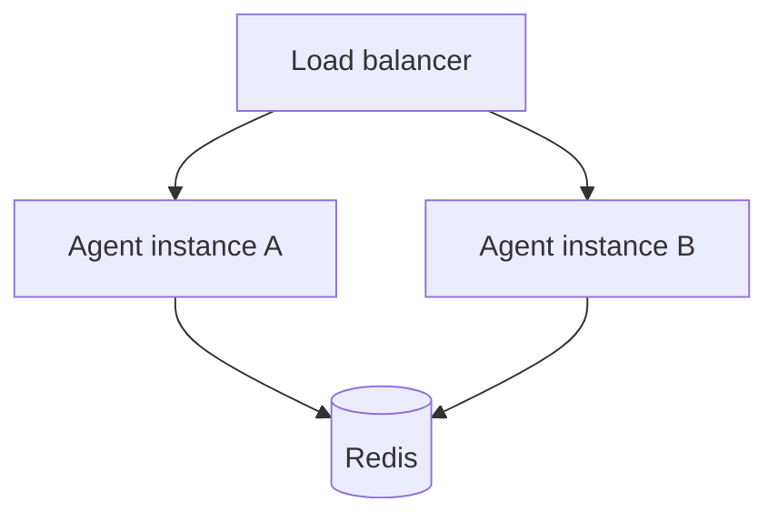
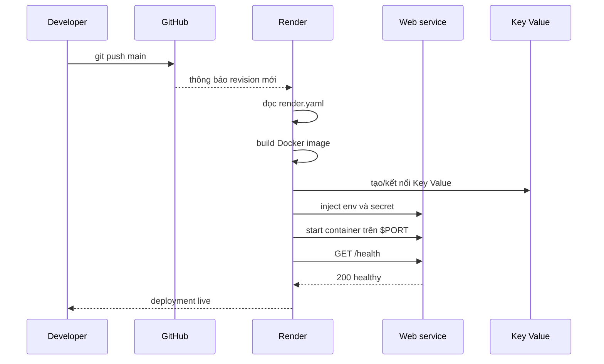
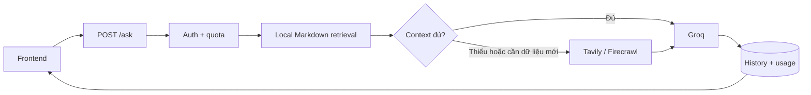

# Day 12 — Quy Trình Đưa Một Web Service Lên Production

> Học viên: **Nguyễn Chí Hiếu** — `2A202601931`
> Production: https://day12-agent-plt0.onrender.com

## 1. Trọng tâm của bài học

Trọng tâm Day 12 là **deployment và vận hành dịch vụ**, không phải xây dựng chatbot.
Chatbot chỉ là workload mẫu để chứng minh hạ tầng có thể phục vụ một ứng dụng thật: có
request tốn chi phí, có state, có dependency bên ngoài và cần được bảo vệ.

Sau bài này, một chương trình chạy trên laptop được chuyển thành service có thể vận hành:

1. Cấu hình tách khỏi code theo 12-Factor.
2. Có health check và log cho máy đọc.
3. Được đóng gói bằng Docker an toàn, tái lập được.
4. Có authentication, rate limit và giới hạn chi phí.
5. Đưa state ra Redis để có thể scale nhiều instance.
6. Xử lý readiness và graceful shutdown khi deploy phiên bản mới.
7. Được khai báo và triển khai lên Render bằng Blueprint.
8. Có kiểm thử và trace để xác nhận hệ thống hoạt động đúng.

## 2. Bức tranh deployment tổng thể

```mermaid
flowchart LR
    DEV[Source code] --> TEST[Automated tests]
    TEST --> IMAGE[Docker image]
    IMAGE --> REGISTRY[Render build]
    CONFIG[Environment variables<br/>và secrets] --> SERVICE[Web service]
    REGISTRY --> SERVICE
    REDIS[(Render Key Value)] --> SERVICE
    SERVICE --> HEALTH[/health]
    SERVICE --> READY[/ready]
    SERVICE --> LOGS[Structured logs]
    USERS[Client] -->|HTTPS| SERVICE
```

Một image được dùng cho mọi môi trường. Điểm khác nhau giữa local và production nằm ở
biến môi trường, secret và địa chỉ dependency, không nằm trong source code.

## 3. Quy trình từ local đến production

### Bước 1 — Chuẩn hóa cấu hình

`app/config.py` đọc cấu hình từ biến môi trường bằng `pydantic-settings`.
`AGENT_API_KEY` là bắt buộc để ứng dụng **fail fast** nếu quên cấu hình secret. Các giá trị
như port, Redis URL, quota và provider đều có thể thay đổi mà không cần build lại image.

Nguyên tắc:

- `.env` chỉ dùng local và đã bị Git bỏ qua.
- `.env.example` chỉ chứa tên biến và giá trị mẫu không nhạy cảm.
- Production secret được nhập trong Render Dashboard hoặc qua `sync: false`.
- Không in API key, connection string hay prompt nội bộ vào log/trace.

Các thông số nền tảng đang dùng:

| Biến | Giá trị local mặc định | Ý nghĩa |
|---|---:|---|
| `PORT` | `8000` | Cổng process lắng nghe; cloud có quyền ghi đè |
| `AGENT_API_KEY` | Không có | Secret bắt buộc, thiếu thì app không khởi động |
| `REDIS_URL` | `redis://localhost:6379/0` | Redis database số 0 khi chạy trực tiếp |
| `RATE_LIMIT_PER_MINUTE` | `10` | Số request tối đa cho mỗi `X-User-ID` trong 60 giây |
| `MONTHLY_BUDGET_USD` | `10.0` | Ngân sách mỗi user trong một tháng UTC |
| `LOG_LEVEL` | `INFO` | Mức log của service |

**Khó khăn thường gặp:** biến môi trường có thể đến từ `../.env`, `.env` hoặc Render nên
rất dễ sửa nhầm file nhưng process vẫn đọc giá trị cũ. `Settings` còn được cache trong một
process; sau khi đổi `.env` phải restart app/container. Trên cloud, thiếu `AGENT_API_KEY`
làm startup thất bại là hành vi mong muốn, không nên “chữa” bằng cách thêm key mặc định.

### Bước 2 — Tạo tín hiệu vận hành

Service cung cấp hai probe khác nhau:

| Endpoint | Câu hỏi cần trả lời | Khi nào lỗi |
|---|---|---|
| `/health` | Process còn sống không? | Event loop hoặc process hỏng |
| `/ready` | Instance đã sẵn sàng nhận traffic chưa? | Đang shutdown hoặc Redis không dùng được |

`/health` không kiểm tra sâu Redis vì dependency lỗi tạm thời không có nghĩa process cần
bị khởi động lại liên tục. `/ready` mới quyết định instance có nên nhận request hay không.

Log được xuất dạng JSON để nền tảng cloud có thể tìm kiếm theo event, status và user mà
không phải tách một chuỗi log tự do.

Thông số probe hiện tại:

| Nơi kiểm tra | Chu kỳ | Timeout | Số lần lỗi | Endpoint |
|---|---:|---:|---:|---|
| Docker image | 30 giây | 5 giây | 3 | `/health` |
| Docker Compose | 10 giây | 3 giây | 5 | `/health` |
| Redis trong Compose | 10 giây | 3 giây | 5 | `redis-cli ping` |
| Render | Do nền tảng quản lý | Do nền tảng quản lý | Do nền tảng quản lý | `/health` |

`/health` trả `200` với version `1.0.0` khi process sống và trả `503` lúc shutdown.
`/ready` trả `200` chỉ khi Redis `PING` thành công; Redis lỗi hoặc app đang shutdown thì
trả `503`.

**Khó khăn thường gặp:** nếu cho `/health` gọi Redis, một lỗi Redis ngắn sẽ khiến
orchestrator restart cả app và tạo restart loop. Ngược lại, nếu `/ready` không kiểm tra
Redis thì load balancer vẫn chuyển request vào instance chưa phục vụ được. Probe cũng phải
nhẹ và hoàn thành trước timeout, nếu không một service khỏe vẫn bị đánh dấu lỗi.

### Bước 3 — Đóng gói bằng Docker

`Dockerfile` dùng multi-stage build: stage đầu cài dependency, stage cuối chỉ nhận artifact
cần chạy. Container chạy bằng non-root user và chỉ copy những file runtime cần thiết.

`docker-compose.yml` mô tả hai service:

- `agent`: FastAPI web service.
- `redis`: state store nằm ngoài process của agent.

Tên service `redis` trở thành hostname nội bộ trong mạng Compose, vì vậy container dùng
`redis://redis:6379/0`, không dùng `localhost`.

Thông số container:

| Thông số | Giá trị | Giải thích |
|---|---|---|
| Base image | `python:3.11-slim` | Dùng ở cả builder và runtime |
| Runtime UID | `10001` | Process chạy bằng `appuser`, không chạy root |
| Cổng trong container | `8000` | Uvicorn bind `0.0.0.0:8000` nếu không có `PORT` |
| Cổng host Compose | `8001` | Mapping mặc định `${HOST_PORT:-8001}:8000` |
| Redis image | `redis:7-alpine` | Nhẹ, bật AOF bằng `--appendonly yes` |
| Redis volume | `redis-data:/data` | Giữ dữ liệu qua lần recreate container |

Có thể đổi cổng ngoài bằng `HOST_PORT=8012`; việc này không đổi cổng `8000` bên trong
container. `EXPOSE 8000` chỉ là metadata, không tự publish cổng ra máy host.

**Khó khăn thường gặp:** dùng `localhost` từ container sẽ trỏ về chính container agent,
không phải Redis. Các lỗi phổ biến khác là nhầm cổng host với cổng container, đưa `.env`
hoặc cache vào image, và copy dependency build không đầy đủ sang runtime stage. Compose
dùng `depends_on` kèm `service_healthy` để agent không khởi động trước Redis, nhưng ứng
dụng vẫn cần `/ready` vì dependency có thể hỏng sau startup.

### Bước 4 — Bảo vệ tài nguyên production

Luồng `/ask` kiểm tra các guard trước khi gọi workload tốn chi phí:

```text
request → API key → rate limit → cost guard → xử lý → lưu usage → response
```

- API key xác định người được phép gọi.
- Sliding-window rate limit chặn burst request.
- Cost guard chặn khi ngân sách tháng đã hết.
- Chỉ ghi usage sau khi workload hoàn thành.

Thông số guardrail:

| Cơ chế | Giá trị hiện tại | Redis key/trạng thái |
|---|---:|---|
| API authentication | Một `AGENT_API_KEY` | So sánh constant-time bằng `compare_digest` |
| Rate limit | 10 request / 60 giây / user | ZSET `ratelimit:<user_id>`, TTL 60 giây |
| Cost guard | 10 USD / user / tháng UTC | `cost:<user_id>:YYYY-MM`, TTL 40 ngày |
| Câu hỏi | 1–2000 ký tự | Pydantic kiểm tra trước khi xử lý |

`X-User-ID` là đơn vị chia quota. Nếu client không gửi header này, mọi request dùng chung
user `anonymous`, nên cũng dùng chung rate limit và ngân sách.

Thứ tự này quan trọng: nếu gọi model trước rồi mới kiểm tra quota thì hệ thống vẫn mất tiền
dù cuối cùng trả lỗi cho client.

**Khó khăn thường gặp:** thứ tự “check trước, ghi nhận sau” dễ bị đảo và làm request thứ
10 bị chặn sớm. Member trong Redis ZSET phải duy nhất; chỉ dùng timestamp có thể làm hai
request ghi đè nhau. Cost guard hiện kiểm tra tổng đã ghi trước khi gọi model rồi ghi chi
phí thực tế sau response; với nhiều request đồng thời vẫn có một khoảng vượt ngân sách nhỏ,
muốn chặn tuyệt đối cần reserve ngân sách bằng thao tác Redis atomic.

### Bước 5 — Tách state để scale ngang

Lịch sử hội thoại, cửa sổ rate limit và chi phí tích lũy được lưu trong Redis. Instance
FastAPI không giữ dữ liệu cần chia sẻ trong RAM, nên request tiếp theo có thể đến instance
khác mà vẫn thấy cùng state.



Khi Render gửi `SIGTERM`, instance chuyển sang trạng thái chưa ready, ngừng nhận request
mới, chờ request đang chạy kết thúc rồi mới thoát. Đây là nền tảng của rolling deployment
không làm rơi request.

Thông số state:

| Dữ liệu | Cấu trúc | Giới hạn/TTL |
|---|---|---:|
| Lịch sử hội thoại | Redis List `history:<user_id>` | 20 message gần nhất, TTL 7 ngày |
| Rate limit | Redis Sorted Set | Cửa sổ và TTL 60 giây |
| Chi phí | Redis String/float | TTL 40 ngày |

Giới hạn 20 message ngăn prompt và chi phí token tăng vô hạn. TTL 7 ngày tự dọn hội thoại
không còn hoạt động; TTL 40 ngày của chi phí giữ thêm dữ liệu để đối soát sau khi sang tháng.

**Khó khăn thường gặp:** `fake://` tiện cho test nhưng vẫn là state trong RAM, vì vậy không
được dùng ở production hoặc khi scale. Khi cài signal handler phải lưu và gọi lại handler
của Uvicorn; nếu ghi đè mà không gọi handler cũ, app bật cờ shutdown nhưng không thoát và
cuối cùng vẫn bị `SIGKILL`. Redis URL trên cloud còn có credential nên tuyệt đối không ghi
nguyên chuỗi này vào log.

### Bước 6 — Khai báo hạ tầng Render

`render.yaml` là bản mô tả deployment có thể review và tái tạo:

- Web service `day12-agent`, runtime Docker.
- Health check path `/health`.
- Render Key Value `day12-redis`.
- `REDIS_URL` được nối từ connection string của Key Value.
- Secret dùng `sync: false`; cấu hình không nhạy cảm có giá trị rõ ràng.

Luồng triển khai thực tế:



Thông số Blueprint production:

| Nhóm | Giá trị |
|---|---|
| Web service | `day12-agent`, runtime Docker, plan `free` |
| State service | `day12-redis`, Render Key Value plan `free` |
| Health path | `/health` |
| LLM | Groq `openai/gpt-oss-20b`, tối đa 2048 output token |
| Reasoning | `low`, không trả reasoning nội bộ |
| RAG | Bật local RAG và web search |
| Web retrieval | Tối đa 4 kết quả; scrape tối đa 1 trang |
| Guardrail | 10 request/phút; 10 USD/tháng/user |
| Fallback | Groq lỗi thì cho phép chuyển sang mock |

Các secret cần nhập trên Render là `AGENT_API_KEY`, `GROQ_API_KEY`, `TAVILY_API_KEY` và
`FIRECRAWL_API_KEY`. `REDIS_URL` không nhập tay: Blueprint lấy `connectionString` từ
`day12-redis` để tránh sai hostname hoặc credential.

**Khó khăn thường gặp:** Blueprint sync thành công chưa có nghĩa web service deploy thành
công; phải mở build/start log của resource. Render cung cấp `PORT` động nên lệnh start phải
dùng `${PORT:-8000}`. Free plan có thể cold start, khiến request đầu chậm hơn bình thường.
Một lỗi secret thường chỉ lộ ở startup hoặc lúc gọi provider; vì vậy sau mỗi deploy phải
kiểm tra lần lượt `/health`, `/ready` rồi mới kiểm thử `/ask`.

## 4. Các checkpoint và ý nghĩa

| Checkpoint | Phần triển khai | Kết quả cần đạt |
|---|---|---|
| CP0 | Môi trường | Clone đúng repo, cài dependency, chạy được test |
| CP1 | 12-Factor và observability | Env config, fail fast, `/health`, JSON log |
| CP2 | Containerization | Multi-stage image, non-root, Compose hoạt động |
| CP3 | Production guardrails | Auth, rate limit, cost guard dùng Redis |
| CP4 | Scaling và reliability | Stateless, `/ready`, SIGTERM và graceful shutdown |
| CP5 | Cloud deployment | Render build thành công, URL public và Redis kết nối |

Các checkpoint tạo thành một chuỗi phụ thuộc. Ví dụ, CP5 không chỉ là bấm Deploy: nó dùng
image của CP2, config của CP1, Redis của CP3–CP4 và probe của CP1–CP4.

## 5. Cấu trúc file theo trách nhiệm deployment

| File/thư mục | Trách nhiệm |
|---|---|
| `app/config.py` | Đọc env và kiểm tra cấu hình lúc startup |
| `app/main.py` | API, health/readiness và thứ tự guardrails |
| `app/logging_utils.py` | Structured logging |
| `app/auth.py` | Xác thực `X-API-Key` |
| `app/rate_limiter.py` | Rate limit dùng Redis |
| `app/cost_guard.py` | Theo dõi và chặn vượt ngân sách |
| `app/store.py` | State dùng chung giữa các instance |
| `app/lifecycle.py` | Startup, readiness và graceful shutdown |
| `Dockerfile` | Runtime image |
| `docker-compose.yml` | Môi trường nhiều service trên local |
| `render.yaml` | Blueprint production |
| `tests/` | Quality gate trước khi deploy |
| `screenshots/` | Bằng chứng deployment |

## 6. Chạy và kiểm tra ở local

### Chạy trực tiếp bằng Python

```powershell
python -m venv .venv
.venv\Scripts\Activate.ps1
pip install -r requirements.txt
Copy-Item .env.example .env
pytest tests -q
uvicorn app.main:app --host 0.0.0.0 --port 8012
```

Cổng `8012` được dùng khi chạy thủ công để không xung đột với service khác đang dùng
`8000`. Trên Render, ứng dụng phải bind vào biến `$PORT` do nền tảng cấp.

### Chạy bằng Compose

```powershell
docker compose build
docker compose up -d
docker compose ps
docker compose logs agent
```

Compose xuất service tại `http://localhost:8001` theo mặc định. Muốn dùng cổng `8012`, đặt
`HOST_PORT=8012` trong `.env` trước khi chạy `docker compose up`.

### Smoke test

```powershell
# Chạy Uvicorn trực tiếp ở trên: 8012; chạy Compose mặc định: 8001
$baseUrl = "http://localhost:8012"
Invoke-RestMethod "$baseUrl/health"
Invoke-RestMethod "$baseUrl/ready"
Invoke-RestMethod "$baseUrl/capabilities"
```

Với endpoint cần auth:

```powershell
$headers = @{ "X-API-Key" = "<AGENT_API_KEY>" }
$body = @{ question = "Giải thích readiness khi deploy" } | ConvertTo-Json
Invoke-RestMethod "$baseUrl/ask" -Method Post -Headers $headers `
  -ContentType "application/json" -Body $body
```

## 7. Deploy lên Render

1. Push commit đã qua test lên nhánh `main`.
2. Trong Render chọn **New → Blueprint** và kết nối đúng repository.
3. Chọn branch `main`; Blueprint Path để `render.yaml`.
4. Nhập các secret mà giao diện yêu cầu, tối thiểu `AGENT_API_KEY` và
   `GROQ_API_KEY` nếu bật provider Groq.
5. Nhập `TAVILY_API_KEY` và `FIRECRAWL_API_KEY` nếu bật phần web retrieval mở rộng.
6. Chọn **Deploy Blueprint** và theo dõi build log.
7. Khi deploy xanh, kiểm tra `/health`, `/ready`, trang `/docs` và một request `/ask`.
8. Xác nhận dashboard hiển thị web service online và Redis connected.

Không đưa nội dung secret từ `.env` lên GitHub. Nếu nghi ngờ key đã lộ, revoke/rotate key
ở nhà cung cấp và cập nhật Render ngay.

## 8. Chẩn đoán lỗi deployment

| Triệu chứng | Kiểm tra đầu tiên | Nguyên nhân thường gặp |
|---|---|---|
| Build failed | Build log và Dockerfile | Dependency hoặc đường dẫn copy sai |
| Service không bind port | Start log | Hard-code port thay vì dùng `$PORT` |
| `/health` lỗi | Process log | App crash hoặc thiếu env bắt buộc |
| `/health` xanh, `/ready` đỏ | Redis và lifecycle | Redis URL sai hoặc dependency chưa sẵn sàng |
| `/ask` trả 401 | Header request | Thiếu/sai `X-API-Key` |
| `/ask` trả 429 | Rate-limit state | Gọi quá nhanh trong cửa sổ trượt |
| Chạy local nhưng lỗi cloud | Env và filesystem | Dựa vào `.env`, localhost hoặc file local |
| Deploy revision mới không đổi | Blueprint sync/build log | Sai branch, sai repo hoặc build cache |

Quy trình xử lý nên đi từ dưới lên: revision → build → startup → health → readiness →
endpoint nghiệp vụ → dependency bên ngoài. Không bắt đầu bằng việc sửa frontend khi
container còn chưa healthy.

## 9. Workload demo: chatbot và RAG

Phần AI là lớp mở rộng đặt trên hạ tầng đã hoàn thiện:



Router không có nhánh riêng cho bất kỳ công nghệ cụ thể nào. Nó đo độ phủ của câu hỏi
trong tài liệu local. Nếu còn thuật ngữ quan trọng chưa được phủ, Tavily nhận một truy
vấn tổng quát ưu tiên tài liệu triển khai; kết quả được xếp hạng bằng dấu hiệu URL tài liệu
thay vì bảng ánh xạ tên công nghệ → domain. Vì vậy một công cụ mới vẫn đi qua đúng luồng.

Thông số workload mở rộng:

| Thông số | Giá trị | Tác động |
|---|---:|---|
| `GROQ_TIMEOUT_SECONDS` | 25 giây | Hủy request provider bị treo quá lâu |
| `GROQ_MAX_TOKENS` | 2048 | Cho phép trả lời kỹ thuật dài hơn nhưng vẫn giới hạn chi phí |
| `GROQ_TEMPERATURE` | 0.2 | Giữ câu trả lời ổn định hơn khi demo kỹ thuật |
| `RAG_TOP_K` | 4 | Lấy tối đa 4 đoạn local phù hợp |
| `RAG_MAX_CONTEXT_CHARS` | 9000 | Chặn context local phình quá lớn |
| Ngưỡng phủ local | 0.8 | Dưới 80% thuật ngữ quan trọng thì cân nhắc web |
| `WEB_SEARCH_TIMEOUT_SECONDS` | 10 giây | Timeout cho Tavily/Firecrawl |
| `WEB_SEARCH_MAX_RESULTS` | 4, code chặn tối đa 8 | Số nguồn web đưa vào xử lý |
| `WEB_SCRAPE_MAX_PAGES` | 1, code chặn tối đa 2 | Số trang Firecrawl đọc sâu |

**Khó khăn của workload demo:** provider và web search đều là mạng ngoài nên latency có
thể biến động hoặc hết quota. Web content là dữ liệu không tin cậy, chỉ được dùng làm
context chứ không được phép điều khiển ứng dụng hay yêu cầu lộ secret. Nếu local corpus vô
tình nhắc đúng tên một công nghệ nhưng không đủ nội dung, phép đo từ khóa có thể đánh giá
độ phủ cao hơn thực tế; trace và danh sách source giúp phát hiện trường hợp này. Fallback
mock giữ endpoint hoạt động khi Groq lỗi nhưng UI phải hiển thị rõ chế độ mock, tránh hiểu
nhầm đó là câu trả lời từ model thật.

Local RAG, web RAG và Groq giúp demo service có dependency, latency và chi phí thực tế.
Chúng không thay đổi mục tiêu chính của bài: đóng gói, cấu hình, bảo vệ, scale, deploy và
quan sát một web service trên cloud.

## 10. Trace dùng để trình bày luồng vận hành

Mỗi response `/ask` có operational trace gồm các bước như auth, rate limit, cost guard,
history, retrieval, LLM và persistence cùng thời gian xử lý. Đây là telemetry để debug,
không phải chain-of-thought và không chứa secret.

Khi demo trên lớp, nên trình bày theo thứ tự:

1. Mở Render Dashboard: web service và Redis đều hoạt động.
2. Mở `/health` và `/ready`, giải thích sự khác nhau.
3. Gửi một request hợp lệ và mở trace.
4. Cho thấy state/usage được lưu ngoài process.
5. Chỉ sau đó mới minh họa local RAG và web retrieval như workload mở rộng.

## 11. Tiêu chí hoàn thành

- Toàn bộ test bắt buộc chạy xanh trước khi push.
- Repo không chứa `.env` hoặc API key thật.
- Docker image chạy non-root và app bind đúng port.
- `/health` và `/ready` phản ánh đúng hai trạng thái khác nhau.
- Auth, rate limit và cost guard chạy trước workload tốn phí.
- State dùng chung nằm ở Redis, không nằm trong RAM của một instance.
- `render.yaml` tái tạo được web service và Key Value.
- Production URL hoạt động và có ảnh bằng chứng trong `screenshots/`.
- Người thực hiện giải thích được toàn bộ luồng từ commit đến request production.

Chi tiết yêu cầu từng checkpoint nằm trong [LAB_GUIDE.md](LAB_GUIDE.md); phần trả lời phản
ánh nằm trong [exercises.md](exercises.md).
